<div align="center">

# PLOS AI · 个人学习操作系统

**完全离线运行 · 数据不出本机 · 本地大模型驱动的学习闭环**

Python 3.11+ ｜ PyQt6 原生桌面端 ｜ Windows 10 / 11 ｜ 断网可用

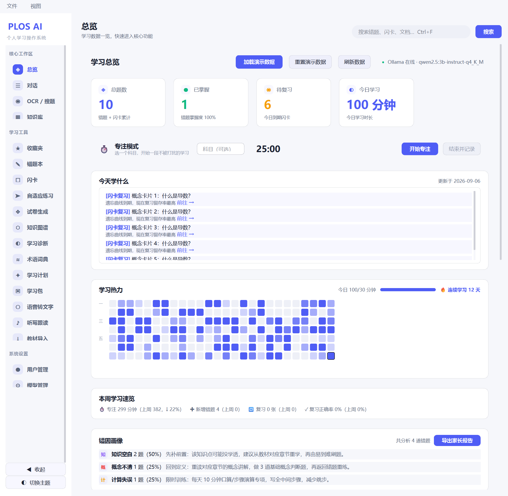

<sub>浅色主题主界面：左侧导航 + 顶部标签栏 + 学习热力图 + 今日复习队列</sub>

</div>

---

## 目录

- [一、这是什么](#一这是什么)
- [二、界面预览](#二界面预览)
- [三、为什么做这个](#三为什么做这个)
- [四、功能一览](#四功能一览)
- [五、整体框架结构](#五整体框架结构)
- [六、核心创新点](#六核心创新点)
- [七、快速开始](#七快速开始)
- [八、一个学生的一天](#八一个学生的一天)
- [九、测试与工程质量](#九测试与工程质量)
- [十、已知不足与后续计划](#十已知不足与后续计划)
- [十一、竞赛提交材料](#十一竞赛提交材料)
- [十二、说明与致谢](#十二说明与致谢)

---

## 一、这是什么

PLOS AI 是一套**桌面学习软件**。它不是"又一个聊天机器人"，也不是"又一个搜题 App"，而是把中学生每天真实会用到的学习动作——导入讲义、提问、拍错题、整理错题本、复习、练习、组卷、排学习计划、看学习数据——串成一条闭环，并且**所有 AI 能力都跑在本地**，拔掉网线照样能用。

打开它是一个普通的 Windows 桌面程序（PyQt6 写的原生窗口，不是浏览器套壳），安装包约 405 MB，里面自带数据库、向量库、插件系统和一个"离线演示数据"开关。它会自动识别电脑配置，在 3B 和 7B 两档本地大模型之间挑一套合适的：内存 16 GB 以上跑 7B，8～12 GB 跑"7B 文本 + 3B 视觉"，只有 7 GB 以下才退到全 3B 并把重资源功能关掉，并如实提示"功能已降级"。

PLOS 是 Personal Learning Operating System 的缩写。之所以敢用"操作系统"这个说法，是因为它确实在做平台该做的事：有账户体系、有插件机制、有数据备份与还原、有主题与偏好设置、有统一的任务栏与消息中心。

### 当前规模（可核对）

| 项目 | 数量 |
|---|---|
| 代码 | `src/plos/` 下约 **4.4 万行** Python |
| 界面 | **24 个面板模块**（对外归成 19 项主功能）+ 主窗口 / 主题 / Toast / 线程池等公共组件 |
| 业务 | **41 个服务模块**，其中 **29 个**由 `AppContext` 服务容器统一装配 |
| 数据 | **30 张 SQLite 表**，**5 个版本化迁移** |
| 插件 | **14 个内置** + **4 个商店插件** |
| 测试 | **304 项** pytest 用例 + **41 项**"学生一天"端到端检查 |
| 交付 | PyInstaller 目录模式产物 + Inno Setup 安装包（405 MB） |

### 关键特性

- **完全离线**：文本、视觉、向量三类模型全部本地推理，断网状态下对话、识别、出题、复习、导出、备份全部可用
- **数据不出本机**：数据只存本机 SQLite 与本地向量库，代码层没有任何遥测或上传逻辑，可抓包验证
- **零成本**：不需要付费账号、不需要独立显卡，一台 8 GB 内存的旧电脑即可运行
- **学习闭环**：错题不只是存档——它会驱动闪卡复习、自适应练习与学习计划调整
- **开放可扩展**：插件机制让功能可以外挂，插件崩溃不会带崩主程序

---

## 二、界面预览

浅色与深色两套主题，全部使用原生控件与手写样式表，全局扁平化：没有阴影悬浮、发光、渐变边框这类"网页特效"。

| 仪表盘（深色） | 学习热力图（深色） |
|---|---|
| 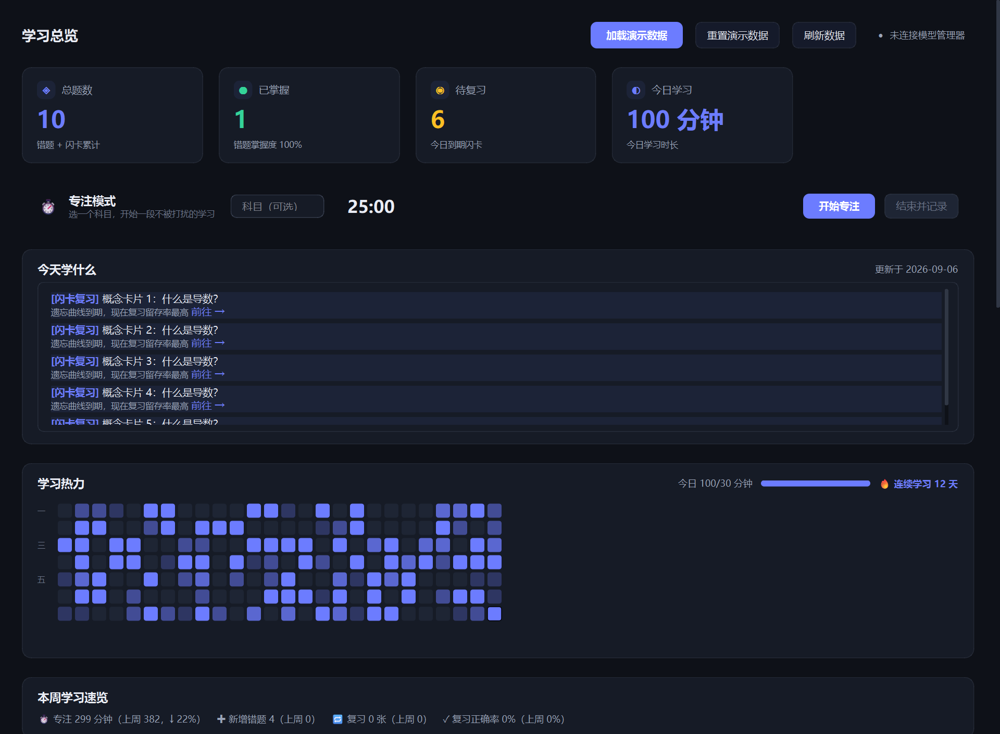 | 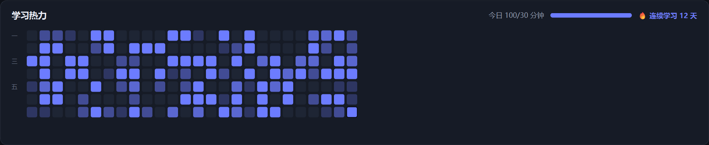 |
| **错题本** | **拍照识题（OCR）** |
| 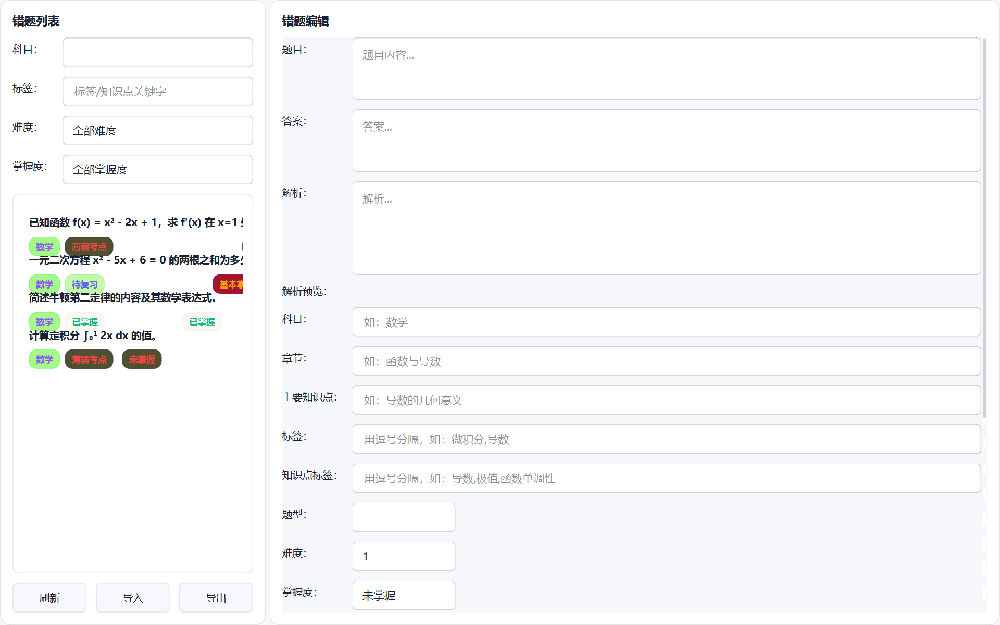 | 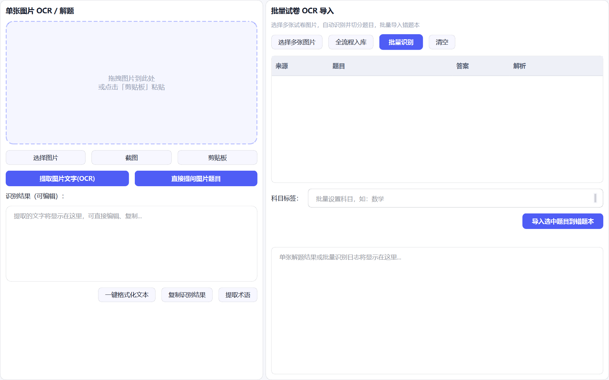 |
| **闪卡复习** | **学习计划** |
| 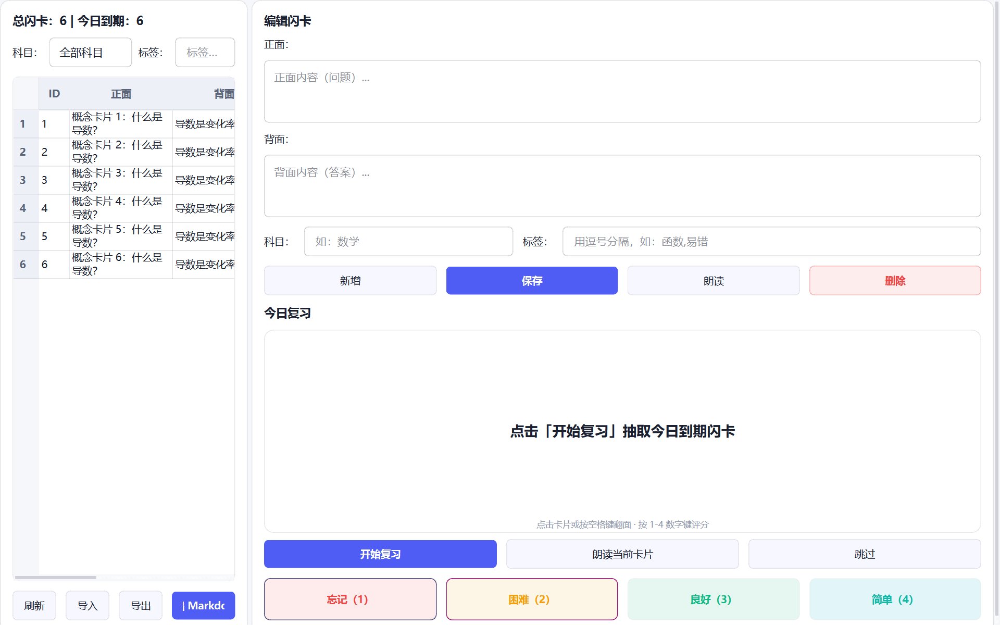 | 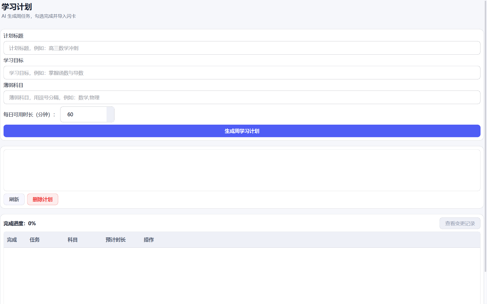 |
| **知识库问答** | **AI 组卷** |
| 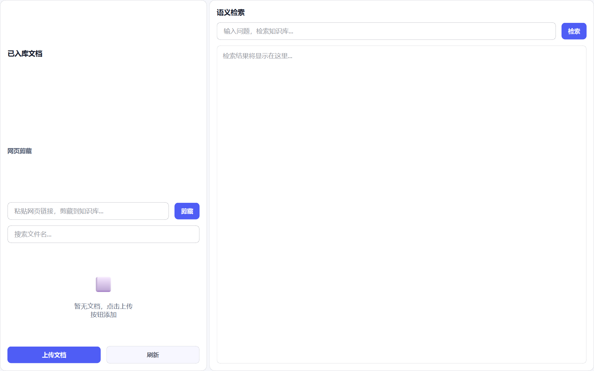 | 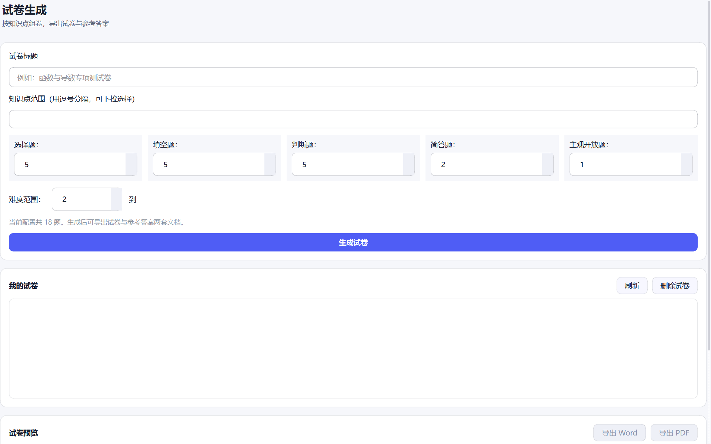 |
| **AI 对话（含公式混排）** | **设置（含强制离线锁）** |
| 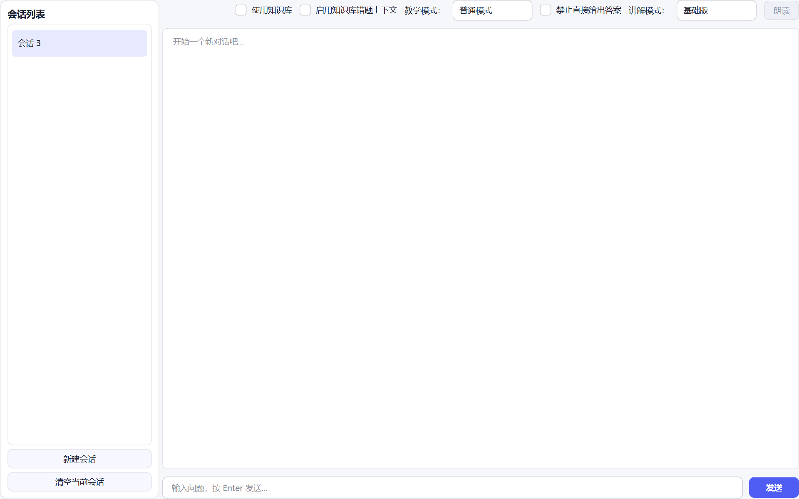 | 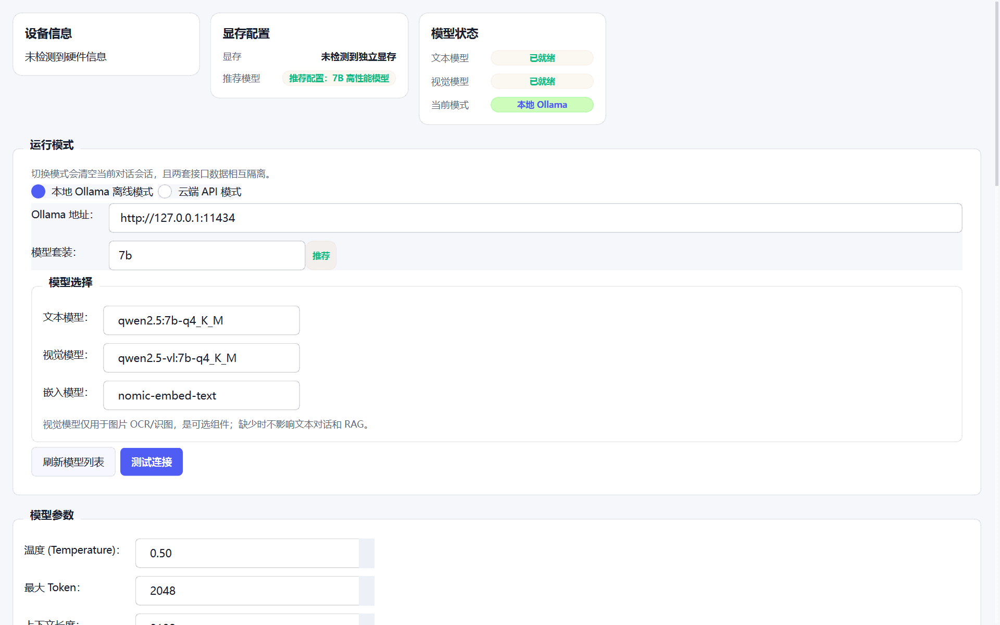 |

> 更多截图（含深色版与术语、练习等面板）见 [`docs/ui_preview/`](docs/ui_preview/)。

---

## 三、为什么做这个

起因很简单：我自己（和身边同学）用学习类工具时，遇到的痛点几乎是一致的。

1. **贵**。学习机动辄三四千元，很多功能还要按年付费，普通家庭不容易负担。
2. **隐私**。拍照搜题类 App 要把题目照片传到云端，而一个学生的错题本其实就是他学习薄弱点的完整画像，我不太愿意把这些照片交给不认识的服务器。
3. **不闭环**。通用 AI 聊天工具很聪明，但它"聊完即忘"——昨天问过的题今天不记得，错过的知识点也不会主动安排复习；而记忆类软件擅长复习，却不理解题目。
4. **不讲教学法**。搜题 App 直接把答案给你，抄完就过去了。可真正有效的学习是"被追问"的过程。

所以目标很明确：**让一个普通学生，用一台普通电脑，获得一个不联网、免费、并且懂一点教学法的 AI 学习助理**。

---

## 四、功能一览

| 模块 | 能做什么 |
|---|---|
| **知识库问答（RAG）** | 导入讲义（Word / PDF / Markdown / TXT / 图片），自动解析切片向量化；提问时先检索自己的资料再回答，界面显示来源与相关度 |
| **AI 对话** | 流式回复、多轮上下文；可切换讲解式 / 苏格拉底追问式，可开启"不直接给答案"，四档讲解深度与可配置教学风格 |
| **拍照识题** | 前置图片增强（去手写笔迹、背景净化、透视校正、锐化）→ 本地视觉模型识别 → 自动补全公式标记 → 切分成独立题目 |
| **错题本** | 一键入库并自动打标（知识点 / 题型 / 难度，全中文）；掌握度标记、标签筛选、变式题生成、思维导图、TTS 朗读、批注高亮 |
| **错题练习卷导出** | 按知识点范围或手动勾选导出 Word / PDF，公式是**真正的数学排版**（Word 用 Office 原生公式，PDF 为上下结构分式），并可导出参考答案 |
| **AI 组卷** | 按"知识点 + 各题型数量 + 难度区间"生成整卷，输出试卷与答案两份文件 |
| **闪卡复习** | 错题一键转闪卡，SM-2 记忆曲线（1、3、7、15、30 天），四档评分 |
| **自适应练习** | 按知识点出题，判分后给出下一题难度建议，复习队列按掌握度自动排 |
| **学习计划** | 生成周计划；**新增错题会自动插入针对性复习任务**，掌握度变化会重排优先级，每次调整可查 |
| **学习统计** | 学习时长热力图、连续天数、周报、错题学科分布、闪卡正确率、掌握度汇总 |
| **学习诊断** | 错因四象限画像与训练处方、家长报告导出 |
| **术语 / 笔记 / 讲义包** | 从文本提取专业术语词典、笔记批注、导出可分发学习包 |
| **图片预处理 / OCR / 语音** | 图片增强独立入口；语音转写（可选模型）；朗读内容 |
| **数据安全** | 多用户隔离、自动滚动备份、完整备份（含附件）、带事务回滚的还原、数据库完整性检查 |
| **插件系统** | 14 个内置（番茄钟、函数图像、元素周期表、成绩簿、口算、公式手册、方程配平、课程表、古诗词、抽签、单位换算、学习日志、考试倒计时、计算器）+ 4 个商店插件 |

---

## 五、整体框架结构

### 5.1 四层架构：层间只走接口

```
┌────────────────────────────────────────────────────────────
│  界面层  src/plos/ui/
│  主窗口（侧边导航 + 顶部标签栏 + 任务栏 + 托盘）
│  24 个面板 · 主题令牌与 QSS · Toast · 公式混排控件 · 线程池
│  铁律：面板只做「展示 + 交互」，不写业务逻辑、不直连数据库
├────────────────────────────────────────────────────────────
│  服务层  src/plos/services/
│  对话 · 知识库(RAG) · OCR · 图片增强 · 错题本 · 错题试卷导出
│  闪卡(SM-2) · 自适应练习 · 组卷 · 学习计划 · 统计 · 诊断报告
│  术语 · 思维导图 · 示意图 · 语音(ASR/TTS) · 学习包 · 备份 · 用户
│  铁律：不 import Qt —— 所以能无界面测试、能被 CLI 复用
├────────────────────────────────────────────────────────────
│  AI 层  src/plos/ai/            数据层  src/plos/db/
│  ModelManager 门面（多后端）      Database 单例 + schema + 迁移
│  Ollama / llama.cpp / 云端        SM-2 记忆曲线 · 向量库封装
├────────────────────────────────────────────────────────────
│  核心与工具  core/ · utils/ · config/ · plugins/
│  枚举 · 领域模型 · AppContext 容器 · 配置与硬件探测 · 日志 ·
│  崩溃捕获 · 路径 · 数学渲染 · LaTeX 清洗 · 插件管理
└────────────────────────────────────────────────────────────
```

分层不是为了好看，而是有具体好处：**服务层不依赖 Qt**，所以整个"学生一天"的端到端脚本可以在命令行里跑；**界面层不直连数据库**，所以换界面（比如以后做移动端）不会动到业务。

### 5.2 目录结构

```
plos_ai/
├─ src/plos/
│  ├─ ui/          主窗口 + 24 个面板 + theme_manager/toast/math_text/workers 等组件
│  ├─ services/    41 个业务服务（全部业务逻辑在这里）
│  ├─ ai/          ModelManager、ollama/llamacpp/云端客户端、多模态解析（文档/截图）
│  ├─ db/          Database 单例、schema.sql、版本化迁移、SM-2、向量库封装
│  ├─ core/        枚举、领域模型、常量、AppContext 服务容器
│  ├─ plugins/     builtin 14 个 + store 4 个（清单 plugin.json + 入口 py）
│  ├─ config/      默认配置、加载/保存、硬件探测与模型套装推荐
│  ├─ utils/       路径、日志、崩溃捕获、启动探测、LaTeX 清洗、数学渲染
│  └─ cli.py       命令行工具（doctor / backup / migrate / version）
├─ tests/          304 项单测 + 学生全流程端到端脚本
├─ tools/          打包构建、Markdown→Word、UI 预览等工具
├─ installer/      PyInstaller spec + Inno Setup 脚本
├─ docs/           功能说明书、架构说明、作品介绍、视频脚本、界面截图
└─ 提交材料/        竞赛提交材料（作品介绍、研究报告、测试报告、安装说明等）
```

### 5.3 服务装配：一个容器管住 29 个服务

所有服务集中在 `AppContext` 数据类里按依赖顺序装配：

```
AppContext.build(model_manager)
  UserService → StatisticsService → SearchService → SessionManager
  → ErrorBookService → FlashcardService(挂统计) → PracticeService
  → ExamService → RAGService → TeachingStyleService(必须先于对话)
  → ChatService → OCRService → InputRouter → StudyPlanService
  → NoteAnnotationService → KnowledgeGraphService → DiagnosticReportService
  → TerminologyService → MindMapService → DiagramService → ASRService
  → WebClipService → BackupService → LearningPackageService → …
```

顺序不是随便排的：教学风格服务必须先于对话服务（要把风格注入 system prompt）；错题本建好后要**回挂**学习计划服务，否则"新错题自动插入复习任务"这条链路会断。收益很直接——主窗口构造函数从几十行装配变成几行，测试与预览工具还能只替换其中一部分。

### 5.4 三条核心数据流

**① 问答（RAG 检索增强）**

```
用户提问
  → 是否需要检索？（可开关）
      → 本地嵌入模型把问题向量化
      → 本地向量库检索 top_k 相关片段
      → 计算真实余弦相似度作为"相关度"展示
  → 拼装消息：system(教学风格 + 模式约束) + 历史 + 检索片段 + 本次提问
  → 本地大模型生成（流式，逐字上屏）
  → 落库会话历史 / 更新学习统计
```

**② 拍照识题（图片 → 结构化题目）**

```
图片（拍照 / 截图 / 拖拽）
  → OpenCV 图片增强（去笔迹、背景净化、对比度、锐化、倾斜校正、四点透视）
  → 本地视觉模型识别文字
  → 文本格式化（清乱码 → 补全 \( \) 公式标记 → 归一数学符号）
  → 文本模型把整页切分成若干道独立题目
  → 结构化 {题目, 答案, 解析} → 写入错题本（保留公式标记）
  → AI 自动打标（知识点 / 题型 / 难度，中文）
  → 触发学习计划动态调优 → 仪表盘与薄弱知识点刷新
```

**③ 错题驱动的计划调优（闭环是"活"的关键）**

```
ErrorBookService.add_error()
  ├─▶ SQLite: error_book / user_stat
  ├─▶ StudyPlanService.adjust_plan_on_error_added()
  │      → 取当前活跃计划 → 插入"复习：某某知识点"任务 → 记录调优说明
  └─▶ 掌握度变化 set_mastery()
         → adjust_plan_on_mastery_changed() → 任务优先级重排
```

学生每记一道错题，计划都会跟着变；每标记一次"已掌握"，计划会把对应任务降权。数据不是躺在表里，而是反过来驱动安排。

### 5.5 并发与线程模型

界面卡不卡，取决于这件事做没做对。所有耗时动作（模型推理、文档解析、向量化、试卷导出、备份打包、公式渲染）都走 `QThreadPool`，通过信号回主线程：

- 主线程只做绘制与交互，任何一处都不允许同步等模型
- 渲染结果带**自增 token**，回来时先比对——否则连续切换两道题，先算完的会覆盖后算完的
- 主题相关取值（`is_dark_theme()`）必须在主线程算好再传进后台，后台线程碰 `QApplication` 会直接崩
- 数据库用进程内 `RLock` + `transaction()` 原子上下文，SQLite 开 WAL、外键、`busy_timeout`
- 淡入动画的 `QGraphicsOpacityEffect` 不能在自己的 `finished` 回调里销毁，必须延迟到下一轮事件循环释放

### 5.6 数据与文件布局

30 张表按用途分组（全部本地 SQLite，文件可整体拷走）：

- **账户与配置**：`users`、`settings`、`user_stat`、`teaching_style_config`
- **知识库**：`documents`、`chunks`（向量本体在本地向量库目录）
- **题目与错题**：`error_book`、`ocr_records`、`subjective_grades`、`exam_papers`、`exam_paper_questions`、`practice_questions`、`practice_records`
- **复习与计划**：`flashcards`、`review_schedules`、`study_plans`、`study_plan_tasks`、`study_plan_adjustments`
- **笔记与词条**：`notes`、`note_annotations`、`terms`、`mindmaps`
- **统计与日志**：`statistics_records`、`study_logs`
- **对话**：`conversations`、`messages`
- **其他能力**：`asr_records`、`diagram_records`、`learning_packages`、`textbook_cache`

磁盘布局：`data/`（数据库、向量库、图片、附件、自动备份）、`config/config.toml`、`logs/plos.log`。多用户在同一套表里靠 `user_id` 隔离，删除用户会级联清理他名下的全部数据。

这些目录默认就在程序自己的文件夹里（便携设计：整个文件夹拷走就带走了全部数据）；如果该位置不可写（例如装到了权限受限的目录），程序启动时会自动改用当前用户的本地应用数据目录，而不是直接启动失败。

### 5.7 扩展机制：插件系统

每个插件是一个目录，含清单 `plugin.json`（名称、版本、作者、描述、入口文件）和入口 `main.py`，入口只需暴露 `register(ctx)`，用 `ctx.register_panel(...)` 把自己的面板注册进主窗口。加载用 `importlib` 动态执行，模块名形如 `plos_plugin_<插件id>_main`；插件加载失败只影响它自己，不会带崩主程序。

### 5.8 技术选型与理由

| 选型 | 为什么选它 | 放弃了什么 |
|---|---|---|
| PyQt6 原生控件 + 手写 QSS | 离线、启动快、内存可控、能做出桌面软件质感 | 全站式 Web UI（体积大、内存高、启动慢，还容易做成"网页感"） |
| SQLite（WAL + 外键 + 迁移） | 单机零部署，事务安全，备份就是拷文件 | MySQL / Postgres（要装服务，学生装不上） |
| ChromaDB + nomic-embed-text | 向量检索完全本地化，持久化到目录 | 云端 embedding（隐私、费用、断网不可用） |
| Ollama 统一后端 | 一条命令拉模型、量化后 CPU 可跑、支持模型常驻 | 纯 llama.cpp（要自己管 GGUF 与参数）、云端 API（数据外流） |
| 自研 LaTeX→HTML 渲染 | 零依赖、任何文本控件都能用、可复制可导出 | 第三方数学渲染库（打包体积大、每次渲染有延迟）、MathJax（必须浏览器内核） |
| PyInstaller 目录模式 + Inno Setup | 启动快、安装包可自定义、能内置自检 | 单文件模式（每次启动解压，慢） |

---

## 六、核心创新点

下面每一条都写清楚：**解决什么问题、怎么做的、难在哪。**

### 1. 离线优先的"错题驱动"学习闭环

**问题**：市面上的工具要么只做一件事（搜题、背单词、组卷），要么各自为政——错题归错题、复习归复习，学生得自己拿主意"下一步学什么"。

**做法**：把错题本做成整个系统的"数据源"，让它同时驱动四件事——闪卡生成、自适应出题、学习计划调整、薄弱点排行。**最有价值的设计是计划会被错题改变**：新增一道错题，系统会给当前活跃计划自动插入一条"复习：某某知识点"的任务，并留下可查的调优记录；把错题标记成"已掌握"，对应任务会被降优先级。计划从一张静态表格变成一份会随学习状态变化的安排。

**难在哪**：错题本服务与计划服务是**双向依赖**（计划要读错题的掌握度，错题要触发计划调整），普通的构造注入会死循环。解法是后置绑定，在 `AppContext` 里按顺序装配完再回挂。

### 2. 零依赖的 LaTeX 公式混排渲染引擎

**问题**：这是一个理科学习工具，"公式显示不出来"等于废掉一半功能。而 Python 桌面端做公式排版通常只有两条路——渲染成图片，或者嵌入浏览器内核跑 MathJax。

**做法**：自行实现 LaTeX → HTML 转换，直接跑在 Qt 富文本上，**不依赖任何第三方数学排版库**：

- 行内公式的分式用线性写法（Qt 行内元素无法堆叠），根号用 `√` + 上划线实现
- **独立公式用一张两行的表格做真上下结构**：分子一行、分母一行、中间用下边框当分数线，运算符用跨行单元格实现
- 上下标用 `<sup>/<sub>`，方程组、不等式、化学式都做了映射
- 每个公式外面套一个自定义协议锚点（`plosmath:` + base64 源码），于是鼠标悬停能提示、点击能复制源码、整段复制拿到的还是带标记的原文
- **兜底比渲染更重要**：解析失败就原样显示源码（不空白、不崩、不毁掉整段文字）；`$...$` 判定极其保守（不跨行、长度有限、内容必须"像数学"、含中文一律当普通文本），所以"这件 $5 元，那件 $10 元"永远不会被当成公式

**难点与代价**：最初用某个科学计算库渲染，开发环境一切正常，但打包脚本为了控制体积把它列在排除列表里，**装出来的 EXE 里公式全部退化成源码**——典型的"开发机能跑不等于交付能用"。换成自研渲染器后，安装包不再需要那个上百 MB 的依赖，渲染也从"每次生成图片"变成毫秒级的纯文本转换。

**全链路覆盖**：公式不只要在聊天框能看，还要能在树表格单元格、批注列表、术语上下文、错题卡片标题里显示——为此写了表格单元格委托，**只对真的含公式的单元格**改用富文本绘制，其余单元格完全走原生路径（不含公式的界面性能开销为零）。导出侧同样配套：Word 生成 Office 原生公式，PDF 用"分子 / 横线 / 分母"三段绘制出真正的上下结构。

### 3. 不依赖模型的图片增强预处理

**问题**：手机拍的错题照片，背景是书桌、上面有自己的蓝笔圈画、纸还是斜的。直接把这种图丢给视觉模型，识别率会明显下降。

**做法**：识别前加一道纯 CPU 的 OpenCV 预处理，支持去笔迹（自动判别蓝/黑）、背景净化、对比度增强、文字锐化、倾斜校正、四点透视裁切、二值化。两个关键设计：

- **区分"笔迹"与"印刷体"**：不是无脑按颜色阈值抠——印刷表格的框线、文字本身的笔画不能被误删。用笔迹掩码 + 矩形框豁免 + 线条抖动判别（印刷线笔直、手写线有抖动），只删真正的手写部分
- **只勾"去笔迹"时不改色调**：早期版本即使用户只想去掉笔迹，也会顺手做一次背景净化而改变整张图色调，看起来像"程序把我的图改了"。现在检测用图与输出用图分离

**效果**：整条流水线在 CPU 上 **0.1～0.2 秒**，不占 GPU、不依赖任何模型，低配机器也能开。

### 4. 带教学法约束的对话编排

**问题**：通用 AI 会直接把答案给你。但"抄答案"不是学习。

**做法**：把教学法做成**可切换的编排参数**，而不是一句写死的提示词：

- 教学模式：普通讲解 / 苏格拉底式（追问引导，不直接给结论）
- 输出约束：开启"不直接给答案"后注入强约束，要求先给思路、留出自己算的空间
- 讲解深度：基础 / 进阶 / 应试 / 研究四档
- 教学风格：可配置鼓励式或严格式、讲解深浅、举例风格、语气

四者都落在同一套消息拼装逻辑里，对上层界面只是一组开关。

### 5. 以架构保证数据主权

**问题**：讲"隐私保护"很容易，难的是**结构上就做不到外传**。

**做法**：三类模型全部本地推理；云端 API 是可选后端且默认关闭；提供**强制纯离线锁**，打开后界面上所有在线入口直接隐藏、网络路径不可达；多用户数据在表级用 `user_id` 隔离，删除用户会级联清理他名下 20 多张表的数据；备份与还原带失败回滚保护；全局崩溃捕获 + 滚动日志，异常不会静默丢数据。

### 6. 按硬件自适应的模型套装与降级策略

**问题**：本地模型的尴尬是"好机器跑得动大模型、旧机器装不上"。

**做法**：探测内存/显存后落到三档套装，并按机器上**真实存在的模型名**解析（同系列不同规格的系列名一样，必须同时比"系列名"和"参数量"，还要处理 `qwen2.5-vl` 与 `qwen2.5vl` 这类别名差异）；低配档位自动关闭视觉识别与图表组件，只保留文字能力，并如实告诉用户"功能已降级"，而不是假装能跑。

**为什么值得单列**：测试时发现"硬件推荐 7B 套装"实际跑的是 3B——只比系列名会先撞上列表里靠前的 3B。这个 Bug 不报错、不崩溃，只是所有回答都变笨了，非常隐蔽。

### 7. 把"能不能交付"当成功能来做

自建三层验证：

1. **304 项自动化测试**（离屏 Qt 运行），覆盖公式渲染、图片增强算法、试卷导出、备份还原、多用户隔离、闪卡闭环、每个面板的渲染；
2. **41 项"学生一天"端到端脚本**：把数据目录指向沙箱（等价于全新安装），从建账号一路跑到备份还原，并**真的调用本机模型**，最后扫一遍运行期日志有没有 ERROR；
3. **打包自检探针**：每次出 EXE 后，用隐藏开关启动打包好的程序，在里面真的做一遍"导入链完整性、插件资源、Word/PDF 试卷生成、OpenCV 图片增强、公式渲染"，全部通过才允许继续出安装包。

---

## 七、快速开始

### 7.1 环境要求

| 项目 | 最低 | 推荐 |
|---|---|---|
| 系统 | Windows 10 / 11（64 位） | Windows 11 |
| Python（源码运行） | 3.11 | 3.12 / 3.13 |
| 内存 | 8 GB（自动降级为 3B 模型） | 16 GB 以上（7B 模型） |
| 磁盘 | 约 8 GB（程序 + 模型） | 12 GB |
| 显卡 | 不需要，纯 CPU 可运行 | 有独立显卡更快 |
| 网络 | **不是必需**（仅首次下载模型时需要） | — |

### 7.2 安装

**方式 A：用安装包（推荐给普通用户）**

双击 `PLOS_AI_Setup_2.3.1.exe`。安装程序**不需要管理员权限**，默认装到当前用户目录 `%LOCALAPPDATA%\Programs\PLOS AI`。

> 想装到 D 盘等其他位置时，请确认该目录当前用户可写；若目标目录权限受限，向导会在"选择目标位置"页提示原因与处理办法（改选"为所有用户安装"即可提权）。

**方式 B：从源码运行（开发者）**

```bash
python -m venv .venv
.venv\Scripts\activate            # Windows
pip install -e .[dev]             # 安装依赖（含开发工具）
python -m plos                    # 启动图形界面
python -m plos.cli doctor         # 环境体检：数据库、目录、模型可达性
```

命令行工具还提供 `plos backup`（立即备份）、`plos migrate`（执行数据库迁移）、`plos version`（版本信息）。

### 7.3 准备本地模型

程序启动时会自动探测本机模型服务。若尚未安装，两步即可（在终端执行）：

```bash
# 1) 安装 Ollama（官网下载 Windows 版）
#    https://ollama.com/download

# 2) 拉取模型（按机器配置二选一）
#    高配（内存 16G 以上）
ollama pull qwen2.5:7b-instruct-q4_k_m
ollama pull qwen2.5-vl:7b-q4_K_M

#    低配（内存 8G 左右）
ollama pull qwen2.5:3b-instruct-q4_K_M
ollama pull qwen2.5-vl:3b-q4_K_M

#    向量模型（知识库检索用，很小）
ollama pull nomic-embed-text
```

**完全不想装模型也能用**：错题本、闪卡、练习、学习计划、统计、备份、插件等本地功能照常可用，界面会如实提示"AI 功能不可用"。

### 7.4 离线使用

模型下载完成之后，程序可以在**完全断网**状态下使用：对话、识别、出题、复习、导出、备份全部可用。设置页的「强制纯离线锁」会隐藏云端配置与教材导入入口，从结构上关闭所有联网路径。程序中**不包含任何数据上传或遥测逻辑**。

### 7.5 常见问题

**Q：提示"未检测到视觉模型 / 图片功能不可用"？**
缺少视觉（VL）模型。按上面命令拉取即可；在此之前其他功能不受影响。

**Q：识别一张图要 20 秒左右，是卡住了吗？**
不是。视觉模型完全在本机 CPU 上运行，首次调用包含模型加载，约 20 秒属正常，之后会快一些。

**Q：能装在旧笔记本上吗？**
可以。程序会按内存与显存自动选择 3B 档位模型，并关闭视觉识别与图表组件，界面上会明确提示已降级。

**Q：换台电脑数据怎么办？**
导出完整备份（含图片附件）为单个文件，在新机器上还原即可；还原过程带失败回滚保护。

---

## 八、一个学生的一天

这条流程就是端到端脚本里跑的流程（不是设想，是每次改动后真的会跑一遍的）。

1. **导入讲义**：讲义拖进知识库，自动解析、切片、向量化；之后提问会先检索自己的资料再回答，界面显示来源与相关度。
2. **拍一道错题**：照片先做图片增强（去笔迹、净化背景、倾斜校正、锐化），再由本地视觉模型识别，并**自动补上公式标记**；文本模型把整页切成一道道独立题目。
3. **错题入库与打标**：AI 给出知识点、题型、难度；知识点必须是中文（早期没写这条约束时，小模型会把"二次函数最值"翻译成英文，直接显示在错题本里）。
4. **一键格式化**："清乱码 → 补公式标记 → 归一数学符号"打包成一个按钮，全局可用且**幂等**——连点两次结果一样。
5. **导出练习卷**：按知识点范围导出 Word / PDF，公式是真正的数学排版；四道题的卷子 Word 73 KB / PDF 52 KB。
6. **闪卡复习**：错题一键变闪卡，按记忆曲线复习，四档评分。
7. **自适应练习与组卷**：按知识点出题，判分后给出下一题难度建议；需要整卷时按题型与难度组卷。
8. **学习计划自动跟着改**：新错题自动插入针对性复习任务，掌握度变化重排优先级。
9. **看数据**：学习热力图、连续天数、周报、错题分布、闪卡正确率、薄弱知识点排行。
10. **数据安全**：自动滚动备份 + 手动全量备份 + 带回滚的还原 + 完整性检查。

---

## 九、测试与工程质量

- **304 项** pytest 用例全部通过（离屏 Qt 运行）；其中相当一部分是"回归守卫"——每个修过的 Bug 都补了用例并写清当初为什么错
- **41 项**"学生一天"端到端检查全部通过（真实调用本地模型，数据目录置于空白沙箱）
- 打包自检：`2.3.1 builtin=14 store=4 export=ok enhance=ok mathhtml=ok`
- 安装包实机验证：静默安装退出码 0、文件完整、快捷方式正常、卸载干净

测试机上的实测数据（7B 套装，纯 CPU 推理，无 GPU 加速）：

| 任务 | 实测耗时 |
|---|---|
| 图片增强（去笔迹 + 背景净化 + 对比度 + 锐化） | 0.1～0.2 秒 |
| 单张题目识别（含首次加载视觉模型） | 20～24 秒 |
| 批量识别 + 自动切题 | 9～15 秒 |
| 讲义解析切片并向量化入库 | 约 2.5 秒 |
| 知识库语义检索 | 0.1 秒 |
| 结合知识库的问答 | 7～14 秒（流式首字约 0.5 秒） |
| AI 组卷（4 道题） | 6～21 秒 |
| 练习卷导出 | 0.9 秒（Word 73 KB / PDF 52 KB） |
| 闪卡复习、学习统计、备份与还原 | 毫秒级 |

### 测试中发现的四个"隐性 Bug"

它们的共同点是：**不抛异常、测试全绿时也不会暴露**，只有模拟真实使用并核对输出数据才能发现。

| 现象 | 根本原因 | 修复结果 |
|---|---|---|
| 四道题的练习卷导出的 PDF 达 18.68 MB | 中文字体文件被完整嵌入（约 17.47 MB） | 保存前做字体子集化：**18.68 MB → 52 KB**，显示与可复制文本一致 |
| 知识库相关度显示 -317.517 | 以平方欧氏距离套用"1 − 距离"计算相似度 | 改用真实余弦相似度：同例显示 **0.612** |
| "推荐 7B 套装"实际运行 3B 模型 | 模型名只按系列名匹配，命中了列表里靠前的 3B | 同时匹配系列名与参数量；对照实验证明 3B 会把开口向下的抛物线问成"求最小值" |
| 离线学习计划七天任务完全相同 | 降级模板标题未包含星期信息 | 标题加入星期与不同训练动作，并加用例守住"标题互不相同" |

另外还定位并修复了两个会导致进程静默退出的缺陷：异步渲染回调在控件销毁后触发异常（未捕获的槽异常会直接终止进程）、淡入动画特效的释放时机错误导致内存访问越界。

---

## 十、已知不足与后续计划

写得诚实一点，这些是清楚的问题：

**不足**

1. 本地小模型在复杂数学推理上仍有限，3B 模型会出现事实性错误，系统能做的是"有条件时用 7B、低配如实告知降级"；
2. 视觉识别对内存要求较高（视觉模型最小约 3 GB），低配设备需关闭该功能；
3. 知识图谱目前基于共现统计，尚未实现真正的知识结构推理；
4. 缺少跨设备同步能力，多用户仅限同一台电脑；
5. 主观题批改的采分点抽取稳定性不足，只能作为参考；
6. 目前只打包了 Windows 版本，跨平台尚未验证。

**后续计划**

1. 由错题相似度驱动的"同类题推荐与自动变式"，把重做变成做等价题；
2. 让学习计划调整完全可解释（每条调整可展开查看原因）；
3. 视觉模型按需加载与及时释放，降低低配设备内存压力；
4. 关键词 + 语义混合检索，缓解"问法与讲义用词不一致"导致的检索失败；
5. 跨平台适配（至少在 macOS 上验证）。

---

## 十一、竞赛提交材料

仓库内 [`提交材料/`](提交材料/) 目录按省赛要求整理了完整材料（作品介绍、研究报告、功能说明书、测试报告、安装与运行说明、演示视频脚本、源代码副本等）；`docs/` 目录下有更详细的文档：

| 文档 | 内容 |
|---|---|
| [`docs/作品介绍.md`](docs/作品介绍.md) | 完整作品介绍（框架结构、创新点、测试实录） |
| [`docs/功能说明书.md`](docs/功能说明书.md) | 19 项主功能的详细说明与交互设计 |
| [`docs/ARCHITECTURE.md`](docs/ARCHITECTURE.md) | 架构说明 |
| [`docs/DEVELOPING.md`](docs/DEVELOPING.md) | 开发与调试说明 |
| [`docs/视频录制脚本.md`](docs/视频录制脚本.md) | 演示视频分镜与口播稿 |

---

## 十二、说明与致谢

**关于 AI 工具使用（如实说明）**：本项目的选题、需求分析、功能定义、交互设计、测试设计与验收标准由作者独立完成；代码实现过程中使用了 AI 编程助手辅助，属于工具协助。作者能够完整讲解系统架构与各模块实现，并可在现场修改任意模块的功能。

**算法与资料**：间隔重复采用 SM-2 算法；检索增强生成（RAG）为通用技术路线；本地推理使用 Ollama；模型为 Qwen2.5 系列开源模型；界面基于 PyQt6。

**许可证**：本仓库未附开源许可证，仅供评审与学习参考使用；如需引用或二次开发，请先联系作者。

---

<div align="center">

**如果这套东西能让一个买不起学习机的同学，在自己家里的旧电脑上获得一个说得过去的 AI 学习助手，它就值得做下去。**

</div>
